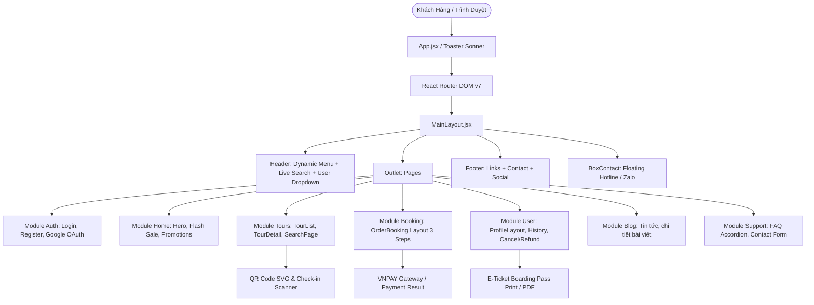
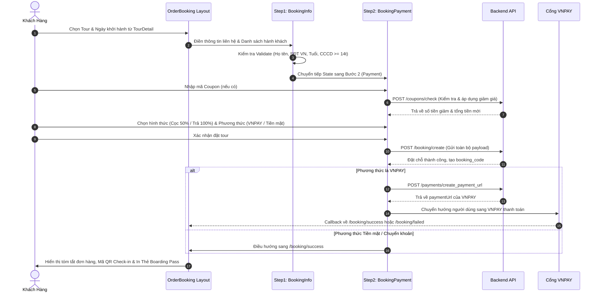

# BÁO CÁO PHÂN TÍCH & ĐỌC HIỂU TOÀN DIỆN MÃ NGUỒN CLIENT (FRONTEND)
> **Dự án:** Hệ thống Đặt Tour Du Lịch Trực Tuyến (**TravelGo**)  
> **Phạm vi phân tích:** Phân hệ **Client** (Bỏ qua phân hệ Admin theo yêu cầu)  
> **Công nghệ nền tảng:** React 19, Vite 8, React Router DOM v7, Tailwind CSS v4, Vanilla CSS Modular, Lucide Icons & FontAwesome.

---

## MỤC LỤC TỔNG QUAN

1. [Kiến Trúc Tổng Thể & Tech Stack](#1-kiến-trúc-tổng-thể--tech-stack)
2. [Cấu Trúc Thư Mục Phân Hệ Client](#2-cấu-trúc-thư-mục-phân-hệ-client)
3. [Cơ Chế Điều Hướng & Định Tuyến (Routing & Auth Guards)](#3-cơ-chế-điều-hướng--định-tuyến-routing--auth-guards)
4. [Tầng Tương Tác Dữ Liệu & API (Data Layer & Request Client)](#4-tầng-tương-tác-dữ-liệu--api-data-layer--request-client)
5. [Phân Tích Chi Tiết Từng Module Nghiệp Vụ](#5-phân-tích-chi-tiết-từng-module-nghiệp-vụ)
   - [5.1. Module Xác Thực (Auth)](#51-module-xác-thực-auth)
   - [5.2. Module Trang Chủ (Home)](#52-module-trang-chủ-home)
   - [5.3. Module Quản Lý & Khám Phá Tour (Tours)](#53-module-quản-lý--khám-phá-tour-tours)
   - [5.4. Module Quy Trình Đặt Tour & Thanh Toán (Booking)](#54-module-quy-trình-đặt-tour--thanh-toán-booking)
   - [5.5. Module Khách Hàng & Cá Nhân Hóa (User / Profile)](#55-module-khách-hàng--cá-nhân-hóa-user--profile)
   - [5.6. Module Tin Tức & Cẩm Nang Du Lịch (Blog)](#56-module-tin-tức--cẩm-nang-du-lịch-blog)
   - [5.7. Module Trợ Giúp & FAQ (Support)](#57-module-trợ-giúp--faq-support)
6. [Hệ Thống Thành Phần Dùng Chung & Tiện Ích Đột Phá (Shared Components)](#6-hệ-thống-thành-phần-dùng-chung--tiện-ích-đột-phá-shared-components)
   - [6.1. Vé Điện Tử & Thẻ Lên Tour (E-Ticket / Boarding Pass)](#61-vé-điện-tử--thẻ-lên-tour-e-ticket--boarding-pass)
   - [6.2. Quét Mã QR Trực Tiếp (QR Scanner Modal)](#62-quét-mã-qr-trực-tiếp-qr-scanner-modal)
   - [6.3. Tìm Kiếm Thông Minh (Live Search Dropdown)](#63-tìm-kiếm-thông-minh-live-search-dropdown)
7. [Luồng Nghiệp Vụ Trọng Tâm (Core Workflows)](#7-luồng-nghiệp-vụ-trọng-tâm-core-workflows)
   - [7.1. Luồng Tìm Kiếm & Khám Phá Tour](#71-luồng-tìm-kiếm--khám-phá-tour)
   - [7.2. Luồng Đặt Tour 3 Bước & Tích Hợp VNPAY](#72-luồng-đặt-tour-3-bước--tích-hợp-vnpay)
   - [7.3. Luồng Tra Cứu Đơn & Check-in Bằng QR Code](#73-luồng-tra-cứu-đơn--check-in-bằng-qr-code)
   - [7.4. Luồng Yêu Cầu Hủy Tour & Hoàn Tiền Tự Động Tính Tỷ Lệ](#74-luồng-yêu-cầu-hủy-tour--hoàn-tiền-tự-động-tính-tỷ-lệ)
8. [Tổng Kết Đánh Giá & Điểm Sáng Kỹ Thuật](#8-tổng-kết-đánh-giá--điểm-sáng-kỹ-thuật)

---

## 1. KIẾN TRÚC TỔNG THỂ & TECH STACK

Phân hệ Client của ứng dụng được xây dựng theo mô hình **Modular Component-Driven Architecture** (Kiến trúc mô-đun hướng thành phần) trên nền React 19 hiện đại nhất, chú trọng tính tách biệt trách nhiệm (Separation of Concerns), tái sử dụng cao và trải nghiệm người dùng mượt mà.



### Chi tiết các công nghệ chính sử dụng:
* **Core UI Library:** `React v19.2.7`, `React DOM v19.2.7`.
* **Routing:** `react-router-dom v7.16.0` với cơ chế cấu hình tập trung thông qua `useRoutes`.
* **Build Tool:** `Vite v8.0.12` tối ưu hóa thời gian HMR và bundle cực nhanh.
* **Styling & CSS:**
  * `Tailwind CSS v4` kết hợp PostCSS và Autoprefixer.
  * Hệ thống Style tùy biến phân lớp độc lập: `style.css` (gốc), `phase1.css` và `phase2.css` (tinh chỉnh nâng cao giao diện).
  * Bộ biểu tượng phong phú: `@fortawesome/fontawesome-free` và `lucide-react`.
* **Thông Báo & Tương Tác (Notification):** `sonner v2.0.7` với cấu hình theme riêng cho Client (`client-toaster`, rich colors, biểu tượng custom).
* **Xử Lý Ngày Tháng:** `date-fns v4.4.0`, `moment v2.30.1`, `react-datepicker v9.1.0`.
* **Xử Lý QR Code & Camera:**
  * Tạo QR: `qrcode.react v4.2.0` (kết xuất chuẩn SVG độ nét cao).
  * Quét QR: `html5-qrcode v2.3.8` (hỗ trợ quét camera thời gian thực và đọc ảnh QR từ máy).
* **Xuất Bản & In Ấn (E-Ticket / PDF):** `jspdf v4.2.1`, `html2pdf.js v0.14.0`, `html2canvas-pro v2.4.3`.
* **Xác Thực Đăng Nhập:** `@react-oauth/google v0.13.5`, `jwt-decode v4.0.0`.

---

## 2. CẤU TRÚC THƯ MỤC PHÂN HỆ CLIENT

Mã nguồn Client được tổ chức chặt chẽ trong thư mục `src/client`:

```
src/client/
├── config/                  # Cấu hình môi trường nội bộ
├── layouts/                 # Layouts cấp cao của client
│   ├── MainLayout.jsx       # Layout chính bọc Header, Outlet, Footer, BoxContact
│   └── index.js
├── routes/                  # Định tuyến toàn client
│   ├── routes.jsx           # Khai báo cây Route Client
│   └── PrivateRoute.jsx     # Route Guard bảo vệ các trang cá nhân
├── shared/                  # Các component, widget và service dùng chung
│   ├── Header.jsx           # Header đa cấp, mobile drawer, user session
│   ├── Footer.jsx           # Footer chân trang
│   ├── BoxContact.jsx       # Widget liên hệ nổi (Zalo, Hotline)
│   ├── Breadcrumb.jsx       # Thanh điều hướng Breadcrumb kèm banner
│   ├── Pagination.jsx       # Phân trang động
│   ├── LiveSearchDropdown.jsx # Dropdown gợi ý địa điểm & tour trực quan
│   ├── TicketQRCode.jsx     # Widget QR vé điện tử kèm phóng to
│   ├── ETicketBoardingPass.jsx # Thẻ lên tour dạng Boarding Pass in A4/PDF
│   ├── QRScannerModal.jsx   # Modal quét camera đọc mã vé điện tử
│   ├── services/
│   │   └── sharedService.js # API lấy danh mục header, gửi liên hệ
│   └── index.js
├── utils/                   # Hàm trợ giúp & cấu hình kết nối mạng
│   ├── request.jsx          # Custom fetch wrapper (tự động đính kèm Bearer token)
│   ├── format.helper.js     # Format giá tiền VND, ngày tháng, số
│   ├── breadcrumb.helper.js # Sinh cấu trúc breadcrumb theo phân cấp
│   └── booking.helper.js    # Tiện ích chuyển đổi nhãn khách, phương thức thanh toán
└── modules/                 # Cụm mô-đun nghiệp vụ độc lập (Feature Modules)
    ├── auth/                # Xác thực (Đăng nhập, Đăng ký, Quên MK, OTP)
    ├── home/                # Trang chủ (Hero banner, Flash sale, Tour nổi bật)
    ├── tours/               # Danh sách tour, Chi tiết tour, Tìm kiếm nâng cao
    ├── booking/             # Đặt tour 3 bước, Thanh toán VNPAY, Tra cứu đơn
    ├── user/                # Quản lý hồ sơ, Lịch sử đặt chỗ, Yêu cầu hoàn/hủy
    ├── blog/                # Tin tức, cẩm nang du lịch
    └── support/             # Trang hỗ trợ khách hàng, giải đáp FAQ
```

---

## 3. CƠ CHẾ ĐIỀU HƯỚNG & ĐỊNH TUYẾN (ROUTING & AUTH GUARDS)

Định tuyến Client được cấu hình tại file `src/client/routes/routes.jsx` và được nạp vào ứng dụng tại `src/routes/index.jsx`.

### 3.1. Bảng Tổng Hợp URL & Phân Cấp Trang Client

| Đường Dẫn (Path) | Component Xử Lý | Quyền Truy Cập | Chức Năng Chính |
| :--- | :--- | :--- | :--- |
| `/` | `Home` | Công khai | Trang chủ, banner tìm kiếm, flash sale, tour hot |
| `/search` | `SearchPage` | Công khai | Tìm kiếm lọc tour theo ngày, điểm đi, khoảng giá, số lượng khách |
| `/category/:slug` | `TourList` | Công khai | Danh sách tour theo danh mục cha/con, lọc & sắp xếp |
| `/tours/detail/:slug` | `TourDetail` | Công khai | Chi tiết tour, lịch trình, gallery ảnh, tính giá, đánh giá |
| `/login` | `Login` | Khách | Đăng nhập tài khoản bằng Email hoặc Google |
| `/register` | `Register` | Khách | Đăng ký tài khoản mới |
| `/forgot-password` | `ForgotPassword` | Khách | Yêu cầu gửi mã khôi phục mật khẩu |
| `/verify-otp` | `VerifyOTP` | Khách | Xác minh mã OTP gửi về Email |
| `/reset-password` | `ResetPassword` | Khách | Cài đặt lại mật khẩu mới |
| `/booking` | `OrderBooking` (Layout) | Công khai | Khung điều phối quy trình đặt tour 3 bước |
| ├── `/booking/info` | `BookingInfo` | Công khai | Bước 1: Nhập thông tin liên hệ và danh sách hành khách |
| ├── `/booking/payment` | `BookingPayment`| Công khai | Bước 2: Chọn hình thức thanh toán & phương thức (VNPAY/Tiền mặt) |
| └── `/booking/success/:id?`| `BookingSuccess`| Công khai | Bước 3: Xác nhận đơn, hiển thị mã QR vé điện tử |
| `/booking/failed` | `BookingFailed` | Công khai | Thông báo lỗi/hủy thanh toán VNPAY kèm tùy chọn thử lại |
| `/booking/lookup/:code?` | `BookingLookup` | Công khai | Tra cứu đơn hàng độc lập bằng mã hoặc quét QR |
| `/blog` | `BlogList` | Công khai | Danh sách tin tức & bài viết du lịch |
| `/blog/detail/:slug` | `BlogDetail` | Công khai | Xem nội dung chi tiết bài viết blog |
| `/support` | `SupportPage` | Công khai | Trang hỗ trợ, FAQ giải đáp thắc mắc, gửi form yêu cầu |
| `/profile` | `ProfileLayout` (Layout) | **Yêu cầu đăng nhập** | Layout trang thông tin tài khoản |
| ├── `/profile/info` | `ProfileInfo` | **Yêu cầu đăng nhập** | Xem & cập nhật thông tin cá nhân |
| ├── `/profile/history` | `TourHistory` | **Yêu cầu đăng nhập** | Lịch sử đặt tour, mở modal đánh giá hoặc hủy vé |
| ├── `/profile/history/:id` | `BookingDetail` | **Yêu cầu đăng nhập** | Chi tiết đơn tour, vé điện tử, yêu cầu hoàn tiền |
| └── `/profile/change-password` | `ProfileChangePassword` | **Yêu cầu đăng nhập** | Đổi mật khẩu tài khoản nội bộ |

### 3.2. Cơ Chế Bảo Vệ Tuyến Đường (`PrivateRoute.jsx`)
* **Nguyên lý kiểm tra:** Kiểm tra sự tồn tại đồng thời của `client_token` và dữ liệu `client_user` trong `localStorage`.
* **Trải nghiệm người dùng:** Nếu chưa đăng nhập, tự động kích hoạt thông báo cảnh báo Sonner: *"Vui lòng đăng nhập để sử dụng chức năng này"* và chuyển hướng sang `/login`, đồng thời lưu trữ URL hiện tại vào `location.state.from` để hỗ trợ quay lại trang trước đó sau khi đăng nhập thành công.

---

## 4. TẦNG TƯƠNG TÁC DỮ LIỆU & API (DATA LAYER & REQUEST CLIENT)

Tất cả các giao tiếp mạng của client được trừu tượng hóa qua file `src/client/utils/request.jsx`:

```javascript
const API_DOMAIN = import.meta.env.VITE_API_URL;

const getHeaders = () => {
  const token = localStorage.getItem("client_token");
  return {
    accept: "application/json",
    "Content-Type": "application/json",
    ...(token ? { Authorization: `Bearer ${token}` } : {}),
  };
};
```

### Các đặc điểm kỹ thuật nổi bật:
1. **Quản lý Token tự động:** Mỗi request đều tự động trích xuất token từ `client_token` và gắn vào Header `Authorization: Bearer <token>`.
2. **Phương thức hỗ trợ đầy đủ:** Cung cấp sẵn các hàm tiện ích bất đồng bộ `get()`, `post()`, `put()`, `update()` (PATCH), `del()` (DELETE).
3. **Môi trường linh hoạt:** Sử dụng `import.meta.env.VITE_API_URL` giúp cấu hình backend URL độc lập giữa môi trường Development và Production.

---

## 5. PHÂN TÍCH CHI TIẾT TỪNG MODULE NGHIỆP VỤ

### 5.1. Module Xác Thực (Auth)
* **Vị trí:** `src/client/modules/auth/`
* **Các tính năng cốt lõi:**
  1. **Đăng nhập Email / Mật khẩu:** Xác thực thông tin qua API `/auth/login`, kiểm tra validate phía client trước khi gửi request (`auth.validator.js`).
  2. **Đăng nhập Mạng xã hội (Google OAuth 2.0):** Tích hợp thư viện `@react-oauth/google`. Sau khi nhận được credential `idToken` từ Google Popup/OneTap, gửi về `/auth/login/google` để đồng bộ tài khoản người dùng và nhận JWT Token.
  3. **Lưu trữ phiên đăng nhập:** Khi thành công, lưu `client_token` và `client_user` vào `localStorage`, hiển thị Toast chào mừng và điều hướng về trang chủ hoặc trang người dùng muốn truy cập trước đó.
  4. **Quy trình quên mật khẩu & khôi phục:** Hỗ trợ nhập Email nhận hướng dẫn -> Nhập mã OTP xác minh -> Đặt mật khẩu mới.

---

### 5.2. Module Trang Chủ (Home)
* **Vị trí:** `src/client/modules/home/`
* **Các thành phần chính:**
  * **`Hero.jsx` (Banner & Tìm kiếm nhanh):** Cho phép nhập địa điểm, chọn ngày khởi hành bằng DatePicker tùy biến (`react-datepicker`), nhập số lượng hành khách. Đi kèm bộ gợi ý thông minh `LiveSearchDropdown` và các Quick Tags phổ biến (ví dụ: Đà Lạt, Phú Quốc, Thái Lan).
  * **`FlashSale.jsx` (Ưu đãi giờ vàng):** Hiển thị các tour giảm giá sâu theo thời gian thực. Sử dụng custom hook `useCountdown.js` để chạy đồng hồ đếm ngược giờ - phút - giây chính xác.
  * **`DomesticTours.jsx` & `ForeignTours.jsx`:** Khám phá tour trong nước và quốc tế theo lưới 4 cột trực quan.
  * **`Promotions.jsx` & `News.jsx`:** Banner quảng bá chương trình và tin bài cẩm nang nổi bật.

---

### 5.3. Module Quản Lý & Khám Phá Tour (Tours)
* **Vị trí:** `src/client/modules/tours/`
* **Trang danh sách tour (`TourList.jsx`):**
  * Tải tour theo phân cấp danh mục `slug`.
  * **Bộ lọc đa năng (`TourFilter.jsx`):** Lọc theo điểm khởi hành (Hà Nội, TP.HCM, Đà Nẵng...), khoảng giá (`priceLevel`), ngày khởi hành, cơ cấu khách (người lớn, trẻ em, em bé).
  * **Sắp xếp (`sort-bar`):** Giá tăng dần, Giá giảm dần, Khuyến mại Hot, và Nút Reset bộ lọc.
  * **Phân trang (`Pagination.jsx`):** Tính toán và đồng bộ trực tiếp với Query Parameter URL (`?page=...`).
* **Trang chi tiết tour (`TourDetail.jsx`):**
  * **Bộ sưu tập ảnh (Gallery):** Xem ảnh chính độ phân giải cao và chuyển đổi mượt mà qua các thumbnail bên dưới.
  * **Điểm nhấn tour (`TourHighlights.jsx`):** Liệt kê các lợi ích nổi bật (vé máy bay khứ hồi, khách sạn tiêu chuẩn, bảo hiểm...).
  * **Lịch trình theo ngày (`TourItineraryTimeline.jsx`):** Thiết kế timeline trực quan theo từng ngày (Ngày 1, Ngày 2...).
  * **Tính giá theo thời gian thực:** Cho phép chọn lịch khởi hành khả dụng từ danh sách `departures`, tùy chỉnh số lượng từng nhóm khách (người lớn, trẻ em, em bé), tự động tính toán tổng tiền tạm tính.
  * **Thanh đặt tour cố định (`TourStickyBookingBar.jsx`):** Tự động bám đáy màn hình khi cuộn trang, giúp người dùng luôn dễ dàng nhấn "Đặt ngay".
  * **Đánh giá & Bình luận (`TourReviewSection.jsx`):** Hiển thị điểm sao trung bình, biểu đồ tỷ lệ sao và các nhận xét chân thực từ những khách hàng đã đi tour.

---

### 5.4. Module Quy Trình Đặt Tour & Thanh Toán (Booking)
Đây là một trong những phân hệ quan trọng và được tổ chức bài bản nhất của ứng dụng.



#### Quy tắc kiểm tra tính hợp lệ dữ liệu chặt chẽ (`booking.validator.js`):
1. **Thông tin liên hệ:** Họ tên bắt buộc; Số điện thoại chuẩn định dạng Việt Nam (`03x, 05x, 07x, 08x, 09x` đủ 10 số); Email hợp lệ theo regex.
2. **Quy tắc phân loại hành khách theo độ tuổi:**
   * **Người lớn (`adults`):** Phải từ đủ 12 tuổi trở lên. Bắt buộc có số điện thoại.
   * **Trẻ em (`children`):** Từ 2 đến dưới 12 tuổi.
   * **Em bé (`infants`):** Dưới 2 tuổi.
   * **Căn cước công dân / Hộ chiếu:** Bắt buộc nhập đối với bất kỳ hành khách nào từ đủ 14 tuổi trở lên.

#### Trang tra cứu đơn hàng độc lập (`BookingLookup.jsx`):
* Khách hàng có thể tra cứu tình trạng đơn hàng bất cứ lúc nào bằng cách nhập mã đơn (`booking_code`) hoặc sử dụng tính năng **Quét mã QR từ camera / tệp ảnh**.
* Hiển thị toàn diện: Trạng thái đơn, trạng thái thanh toán, lộ trình tour, thông tin hành khách, chi tiết thanh toán và xuất trình vé QR.

---

### 5.5. Module Khách Hàng & Cá Nhân Hóa (User / Profile)
* **Vị trí:** `src/client/modules/user/`
* **Trang thông tin cá nhân (`ProfileInfo.jsx`):** Quản lý hồ sơ, cập nhật tên, ngày sinh, số điện thoại, địa chỉ, số CCCD.
* **Đổi mật khẩu (`ProfileChangePassword.jsx`):** Tự động phát hiện loại tài khoản; nếu người dùng đăng nhập bằng Google/Facebook, hệ thống sẽ ẩn tính năng này để tránh xung đột.
* **Lịch sử đặt tour (`TourHistory.jsx`):**
  * Danh sách thẻ tour (`HistoryCard.jsx`) kèm trạng thái trực quan (`StatusBadge.jsx`): *Chờ xác nhận, Đã xác nhận, Đang diễn ra, Đã hoàn thành, Chờ duyệt hủy, Đã hủy, Đã hoàn tiền*.
  * Tích hợp nút **Đánh giá tour** (`ReviewModal.jsx`) cho các chuyến đi đã hoàn thành (chấm điểm từ 1 đến 5 sao và viết cảm nhận).
  * Tích hợp nút **Yêu cầu hủy tour & hoàn tiền** (`RefundRequestModal.jsx`).

#### Bảng Chính Sách Hoàn Tiền Tự Động Theo Số Ngày:
Hệ thống tự động tính toán số ngày còn lại từ ngày hiện tại đến ngày khởi hành (`start_date`):

| Thời Điểm Yêu Cầu Hủy | Tỷ Lệ Hoàn Tiền | Mô Tả & Điều Kiện |
| :--- | :---: | :--- |
| **Trước khởi hành $\ge$ 15 ngày** | **100%** | Hoàn lại toàn bộ chi phí đã thanh toán |
| **Trước khởi hành 8 – 14 ngày** | **70%** | Khấu trừ 30% phí giữ chỗ và điều hành |
| **Trước khởi hành 4 – 7 ngày** | **50%** | Khấu trừ 50% phí dịch vụ vé/khách sạn |
| **Trước khởi hành 1 – 3 ngày** | **30%** | Khấu trừ 70% chi phí phát sinh thực tế |
| **Dưới 24 giờ / Đã khởi hành** | **0%** | Không thể hoàn tiền theo quy định lữ hành |

*Nếu đơn hàng đã thanh toán qua Tiền mặt/Chuyển khoản, Modal sẽ yêu cầu khách hàng cung cấp thông tin tài khoản ngân hàng thụ hưởng (Tên ngân hàng, Số tài khoản, Tên chủ thẻ) để bộ phận kế toán thực hiện giải ngân hoàn tiền.*

---

### 5.6. Module Tin Tức & Cẩm Nang Du Lịch (Blog)
* **Vị trí:** `src/client/modules/blog/`
* Hiển thị danh sách bài viết kinh nghiệm du lịch, ẩm thực, văn hóa vùng miền (`BlogList.jsx`).
* Trang chi tiết bài viết (`BlogDetail.jsx`) hiển thị nội dung phong phú kèm thanh sidebar gợi ý bài viết liên quan (`BlogSidebar.jsx`).

---

### 5.7. Module Trợ Giúp & FAQ (Support)
* **Vị trí:** `src/client/modules/support/`
* Cung cấp danh mục câu hỏi thường gặp (FAQ) dạng Accordion mở rộng/thu gọn tương tác mượt mà: chính sách đổi trả, quy định hành lý, giá vé trẻ em, hướng dẫn check-in bằng mã QR.
* Form gửi thắc mắc trực tuyến được kiểm tra hợp lệ và phản hồi bằng thông báo Sonner.

---

## 6. HỆ THỐNG THÀNH PHẦN DÙNG CHUNG & TIỆN ÍCH ĐỘT PHÁ (SHARED COMPONENTS)

### 6.1. Vé Điện Tử & Thẻ Lên Tour (`ETicketBoardingPass.jsx`)
* **Thiết kế độc đáo:** Lấy cảm hứng từ thẻ lên máy bay (Boarding Pass) hàng không quốc tế kết hợp phong cách nhận diện TravelGo.
* **Thông tin hiển thị:** Mã PNR/Booking, thông tin trưởng đoàn, điểm khởi hành, điểm đến, thời gian tập trung, danh sách số ghế/hành khách, chính sách lưu ý và mã QR check-in khổ lớn.
* **Khả năng in ấn & xuất PDF:** Được tích hợp CSS media query `@media print` riêng biệt và công cụ xuất PDF (`html2pdf.js`), cho phép khách hàng in ra giấy A4 sắc nét hoặc lưu về điện thoại để xuất trình khi lên xe.

```
+----------------------------------------------------------------------------------+
| TRAVELGO BOARDING PASS                                   [ QR CODE CHECK-IN ]   |
| Chuyến đi: Tour Đà Lạt 3N2Đ - Khởi hành từ TP.HCM                                |
| Khách hàng: NGUYEN VAN A                   Mã đơn: #TG-8899                      |
| Giờ tập trung: 05:30 AM                    Ngày đi: 20/10/2026                   |
| Điểm đón: Số 123, đường ABC, Quận 1        Số khách: 02 Lớn, 01 Trẻ em           |
+----------------------------------------------------------------------------------+
```

### 6.2. Quét Mã QR Trực Tiếp (`QRScannerModal.jsx`)
* Sử dụng thư viện `html5-qrcode`.
* Cho phép chọn camera linh hoạt (hỗ trợ chuyển đổi camera trước/sau trên điện thoại).
* **Phản hồi âm thanh tương tác:** Sử dụng Web Audio API tích hợp (`playBeep()`) phát âm thanh bíp thanh gọn khi quét thành công mà không phụ thuộc vào file âm thanh ngoài.
* Hỗ trợ quét qua Camera trực tiếp hoặc tải ảnh chụp mã QR từ máy.

### 6.3. Tìm Kiếm Thông Minh (`LiveSearchDropdown.jsx`)
* Dropdown tìm kiếm hiển thị ngay khi người dùng gõ từ khóa tại ô tìm kiếm trên thanh Hero hoặc trang Search.
* Phân chia rõ ràng giữa **Điểm đến phổ biến** (gợi ý nhanh) và **Tour du lịch nổi bật** (hiển thị ảnh thumbnail, thời lượng, giá ưu đãi và đánh giá sao).

---

## 7. LUỒNG NGHIỆP VỤ TRỌNG TÂM (CORE WORKFLOWS)

### 7.1. Luồng Tìm Kiếm & Khám Phá Tour
1. Khách hàng nhập nhu cầu trên thanh tìm kiếm tại Trang chủ (Địa điểm, Ngày đi, Số lượng) hoặc chọn danh mục trên Header.
2. Hệ thống chuyển hướng đến `/search` hoặc `/category/:slug`.
3. Khách hàng tùy biến bộ lọc nâng cao bên cột trái: Chọn điểm khởi hành cụ thể, chọn khoảng giá mong muốn, lọc theo ngày khởi hành.
4. Danh sách Tour hiển thị dạng Grid Card với hình ảnh sắc nét, huy hiệu giảm giá, thông tin thời lượng và giá vé.

### 7.2. Luồng Đặt Tour 3 Bước & Tích Hợp VNPAY
1. Tại `TourDetail`, khách hàng chọn ngày khởi hành từ danh sách ngày khả dụng và chọn số lượng người lớn, trẻ em, em bé -> Nhấn **Đặt Ngay**.
2. **Bước 1 (Thông tin):** Nhập thông tin người liên hệ và họ tên, ngày sinh, giới tính, CCCD của từng hành khách.
3. **Bước 2 (Thanh toán):** Nhập mã Coupon giảm giá (nếu có). Chọn cọc 50% hoặc thanh toán toàn bộ 100%. Chọn phương thức VNPAY hoặc Tiền mặt/Chuyển khoản.
4. **Xử lý VNPAY:** Nếu chọn VNPAY, client gọi API khởi tạo URL giao dịch và điều hướng sang trang VNPAY. Sau khi thanh toán, VNPAY chuyển hướng về client, hệ thống cập nhật trạng thái đơn thành công.
5. **Bước 3 (Thành công):** Xuất hiện màn hình xác nhận với mã đơn hàng, hóa đơn điện tử và thẻ QR Check-in.

### 7.3. Luồng Tra Cứu Đơn & Check-in Bằng QR Code
1. Khách hàng truy cập `/booking/lookup`.
2. Khách hàng có thể nhập mã đơn hàng dạng văn bản HOẶC nhấn biểu tượng Camera để mở `QRScannerModal`.
3. Hướng camera về phía mã QR vé điện tử (trên điện thoại hoặc vé in).
4. Hệ thống phát âm thanh bíp và tự động mở chi tiết đơn đặt chỗ tương ứng với đầy đủ danh sách hành khách hợp lệ.

### 7.4. Luồng Yêu Cầu Hủy Tour & Hoàn Tiền Tự Động Tính Tỷ Lệ
1. Khách hàng đã đăng nhập truy cập `/profile/history` hoặc `/profile/history/:id`.
2. Nhấn nút **Yêu cầu hủy tour & hoàn tiền**.
3. Hệ thống mở `RefundRequestModal`, tự động phân tích ngày khởi hành và áp dụng chính sách hoàn trả (100%, 70%, 50%, 30% hoặc 0%).
4. Khách hàng chọn lý do hủy, điền số tài khoản nhận hoàn tiền (nếu áp dụng), cam kết đồng ý điều khoản và gửi yêu cầu.
5. Trạng thái đơn được chuyển sang `pending_cancel` (*Chờ duyệt hủy*).

---

## 8. TỔNG KẾT ĐÁNH GIÁ & ĐIỂM SÁNG KỸ THUẬT

1. **Kiến Trúc Module Tách Biệt Rõ Ràng:** Các tính năng (`auth`, `home`, `tours`, `booking`, `user`, `blog`, `support`) được tổ chức độc lập theo từng thư mục nghiệp vụ gồm đầy đủ `pages`, `components`, `services`, `validations`.
2. **Trải Nghiệm Đặt Chỗ Chuyên Nghiệp:** Quy trình Booking 3 bước mượt mà, quản lý trạng thái chuyển tiếp qua `location.state` an toàn, xác thực dữ liệu chặt chẽ theo đặc thù hàng không/lữ hành (kiểm tra độ tuổi, phân loại vé, CCCD/Passport).
3. **Tính Năng Chuyển Đổi Số Hiện Đại:**
   * Tự động sinh mã QR Check-in cho từng đơn tour.
   * Thẻ lên tour dạng Boarding Pass in A4/PDF chuyên nghiệp.
   * Tính năng Quét mã QR bằng Camera trực tiếp giúp nhân viên hướng dẫn viên hoặc khách hàng kiểm tra đơn nhanh chóng không cần giấy tờ.
4. **Chính Sách Hoàn Hủy Minh Bạch:** Xử lý logic hoàn tiền linh hoạt theo mốc thời gian cách ngày khởi hành, tăng sự an tâm cho người dùng.
5. **Thiết Kế Responsive & Thẩm Mỹ Cao:** Giao diện tương thích hoàn hảo từ Mobile, Tablet đến Desktop; tích hợp thanh Sticky Booking bar trên điện thoại, dropdown đa cấp và hệ thống thông báo Sonner đồng bộ.
